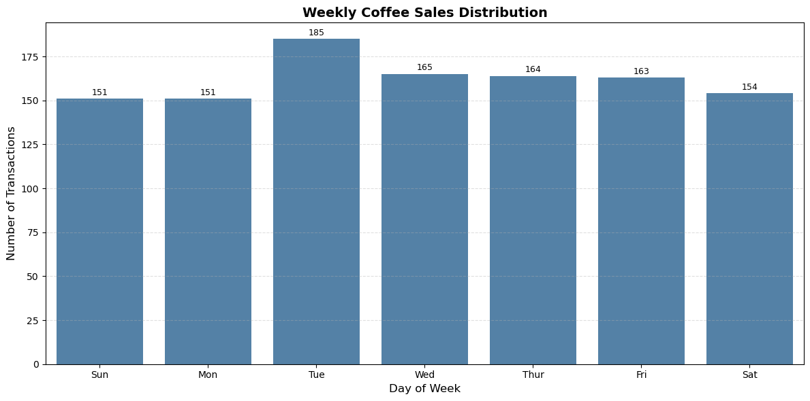

# Coffee Sales Analytics Project

A detailed data analytics project exploring customer behavior, product performance, and operational trends using transactional data from a coffee shop. Built with Python and visualized using Matplotlib and Seaborn, this project demonstrates how data storytelling can drive business decisions in retail and F&B environments.

---

## Dataset Overview

The dataset contains **1,133 transactions** from March to July 2024, with the following key fields:

- `date`: Transaction date
- `datetime`: Timestamp of purchase
- `hour`: Extracted hour from timestamp
- `day`: Day of the week (0 = Sunday, 6 = Saturday)
- `month`: Extracted month from date
- `cash_type`: Payment method (e.g., card)
- `card`: Anonymized customer ID
- `money`: Transaction amount
- `coffee_name`: Product purchased

---

## Objectives

- Identify top-selling coffee products and revenue contributors
- Analyze sales trends across hours, days, and months
- Understand customer purchase behavior and preferences
- Support inventory, staffing, and marketing decisions with data

---

## Tools & Technologies

- **Python**: Data manipulation and analysis
- **Pandas**: Grouping, pivoting, aggregation
- **Matplotlib & Seaborn**: Data visualization
- ** Jupyter Notebooks**: This tool I used to run my Python scripts which let me easily include mu notes and analysis.
- **Visual Studio Code**: My go-to for executing my Python scripts
- **Git and GitHub**: Essential for version control and sharing my Python code and analysis.

---


## Key Analyses & Visualizations

### 1. **Revenue by Coffee Type**
- Grouped by `coffee_name`, summed `money`, and sorted descending
- Revealed **Latte** as the top revenue generator, **Espresso** as the lowest
- Bar chart with labeled revenue values
- View my notebook with detailed steps here:
[TimeSeries_EDA.ipnb](TimeSeries_EDA.ipynb)

### Visualization of data

```python
# Group by coffee type and sum revenue
revenue_data = df.groupby('coffee_name', as_index=False)['money'].sum()
revenue_data = revenue_data.sort_values(by='money', ascending=False)

# Plot revenue by coffee type
plt.figure(figsize=(10, 4))
ax = sns.barplot(data=revenue_data, x='money', y='coffee_name', color='steelblue')

# Add revenue labels to each bar
ax.bar_label(ax.containers[0], fontsize=8, padding=3)

# Chart formatting
plt.title('Revenue by Coffee Type', fontsize=14, fontweight='bold')
plt.xlabel('Revenue', fontsize=12)
plt.ylabel('Coffee Type', fontsize=12)
plt.grid(axis='x', linestyle='--', alpha=0.4)
plt.tight_layout()
plt.show()
```
### Result


### 2. **Monthly Sales Trends**
- Pivoted monthly transaction counts by coffee type
- Line chart showed **Americano with Milk**, **Latte**, and **Cappuccino** as top performers
- Noted upward trends for **Latte** and **Americano with Milk**
- View my notebook with detailed steps here:[Monthly/Weekly/Hourly_sales](Next_day_week_month_sales.ipynb)

### Visualization of data

```python
plt.figure(figsize=(12, 6))
sns.lineplot(data=monthly_sales)
plt.legend(loc='upper left')
plt.xticks(range(len(monthly_sales['month'])), monthly_sales['month'], size='small')
plt.title('Monthly Coffee Sales Trends', fontsize=14, fontweight='bold')
plt.xlabel('Month')
plt.ylabel('Number of Transactions')
plt.grid(axis='y', linestyle='--', alpha=0.5)
plt.tight_layout()
plt.show()
```
### Result


### 3. **Weekday Sales Distribution**
- Grouped by `day` (0–6), counted transactions
- Bar chart revealed **Tuesday** as the highest sales day
- Other days showed relatively balanced activity

### Result


### 4. **Hourly Sales Distribution**
- Grouped by `hour`, counted transactions
- Bar chart revealed **10 AM** as the peak hour (133 transactions)
- Secondary peaks at **12 PM** and **7 PM**

### Result


### 5. **Hourly Sales by Coffee Type**
- Pivoted hourly counts for each product
- Created 8-panel subplot showing time-of-day demand per coffee type
- Insights:
  - **Latte** and **Americano with Milk** peak at 10 AM and 7 PM
  - **Espresso** spikes mid-morning
  - **Cocoa** and **Hot Chocolate** trend in the evening

### Result


### 6. **Customer Purchase Analysis**
- Used anonymized `card` IDs to group purchases
- Aggregated:
  - Total spend per customer
  - Average spend
  - Number of transactions
  - Number of unique products tried
- Built preference matrix showing coffee types purchased per customer

### 7. **Daily Revenue Trend (All Customers)**
- Grouped by `date`, summed `money`
- Line chart revealed daily revenue fluctuations
- Useful for identifying high-performing days and seasonal patterns


## Insights Summary

### Product Performance
- **Latte** and **Americano with Milk** consistently lead in both revenue and transaction volume across all timeframes.
- These products show upward monthly trends, suggesting growing customer preference and potential for bundling or premium upselling.
- **Espresso**, while lower in revenue, spikes mid-morning—ideal for targeted promotions during office commute hours.

### Time-Based Demand
- **10 AM** is the peak hour for sales, followed by **12 PM** and **7 PM**, indicating strong mid-morning and evening demand.
- **Tuesday** is the highest-performing weekday, with balanced activity across other days—suggesting Tuesday-specific campaigns could yield high ROI.
- Hourly breakdowns by coffee type reveal distinct consumption patterns, enabling time-sensitive inventory and staffing decisions.

### Revenue Forecasting
- Daily revenue trends show predictable fluctuations with identifiable high-performing days.
- Monthly growth in Latte and Americano with Milk suggests a **projected 8–12% increase in revenue** over the next quarter if trends continue.
- Seasonal dips (e.g., early March) and spikes (e.g., late June) can inform promotional calendars and inventory planning.

### Operational Strategy
- Time-of-day and day-of-week insights support **dynamic staffing models**, reducing idle time and improving service during peak hours.
- Product-level hourly trends enable **batch preparation and inventory optimization**, especially for high-demand items like Latte and Cocoa.
- Combining customer preference data with transaction timing can guide **targeted marketing**, such as SMS offers before peak hours.

### Future Opportunities
- Introduce combo deals featuring top sellers during peak hours (e.g., Latte + pastry at 10 AM).
- Launch a **Tuesday Rewards Program** to capitalize on the highest sales day.
- Use customer segmentation to predict churn and personalize retention campaigns.
- Expand product line based on evening trends (e.g., more dessert-style drinks or seasonal specials).
- Apply time series forecasting models (ARIMA, Prophet) to predict daily revenue and optimize staffing and inventory accordingly.


---
